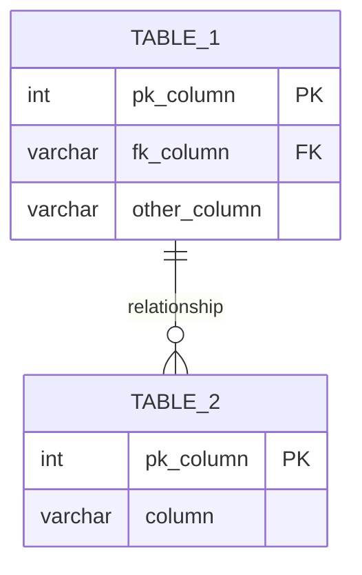

# As-Is Report — {assessmentId}

**Generated:** {generatedAt}  
**Data Owner:** {dataOwner}  
**Source System:** {sourceSystem}  
**Status:** ⚠️ Awaiting sign-off

---

## 1. Source System Overview

| Field | Value |
|-------|-------|
| System | {sourceSystem} |
| Type | {sourceType} |
| Version | {sourceVersion} |
| Host | {host} |
| Schemas in scope | {schemas} |
| Total tables | {totalTables} |
| Total estimated rows | {totalRows} |
| Estimated size (GB) | {estimatedSizeGb} |

---

## 2. Data Quality Baseline

| Metric | Value |
|--------|-------|
| Overall quality score | {qualityScore}/100 |
| Tables with CRITICAL anomalies | {criticalCount} |
| Tables with HIGH anomalies | {highCount} |
| Tables with PII | {piiTableCount} |
| Average null rate | {avgNullRate}% |

---

## 3. Data Dictionary

<!-- Generated by as-is-documenter from profiling output -->

### {schema}.{table_1}

**Description:** {inferred or provided description}  
**Row count:** {rowCount}  
**Quality score:** {score}/100  
**Growth rate:** {growthRate}/month

| Column | Business Name | Type | Nullable | PII | Description |
|--------|--------------|------|----------|-----|-------------|
| {col} | {name} | {type} | {nullable} | {pii} | {description} |

---

## 4. Entity-Relationship Diagram

---

## 5. ETL Object Inventory

### Stored Procedures

| Object | Tables referenced | Business purpose |
|--------|------------------|-----------------|
| {sp_name} | {tables} | {purpose} |

### Views

| View | Source tables | Purpose |
|------|--------------|---------|
| {view_name} | {tables} | {purpose} |

### Triggers

| Trigger | Table | Event | Purpose |
|---------|-------|-------|---------|
| {trigger_name} | {table} | {event} | {purpose} |

---

## 6. Data Lineage

| Source table | Downstream consumers | Notes |
|-------------|---------------------|-------|
| {table} | {views/reports/apps} | {notes} |

---

## 7. SLA Baseline

| SLA | Current value |
|-----|--------------|
| Peak write throughput | {writes/sec} |
| Peak read throughput | {reads/sec} |
| Maintenance window | {window} |
| Recovery time objective | {rto} |

---

## 8. Open Issues

| # | Issue | Severity | Action required |
|---|-------|----------|----------------|
| 1 | {issue} | {severity} | {action} |

---

## Sign-off

| Role | Name | Date | Signature |
|------|------|------|-----------|
| Data Owner | | | |
| Technical Lead | | | |
| Compliance Officer | | | |

_This document must be signed before To-Be design begins._
